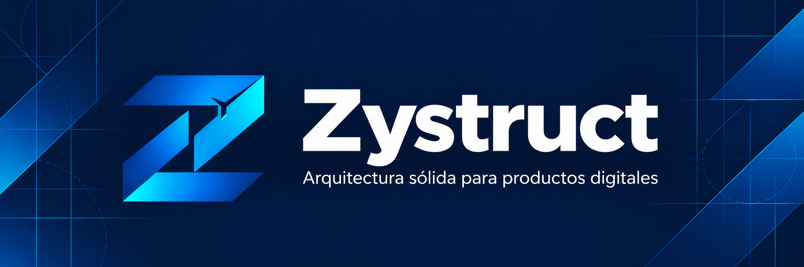
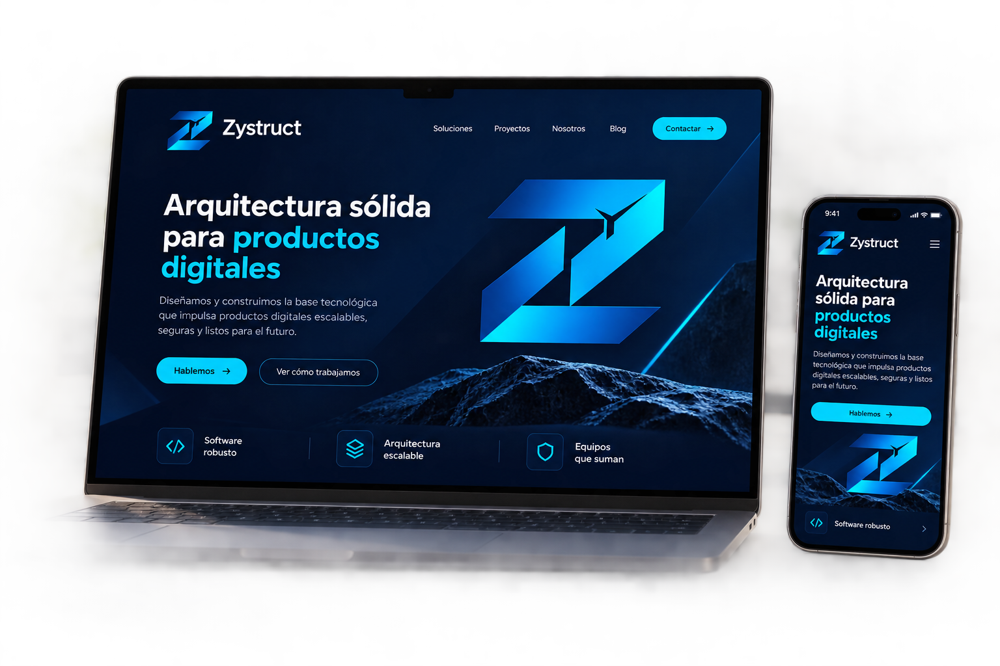
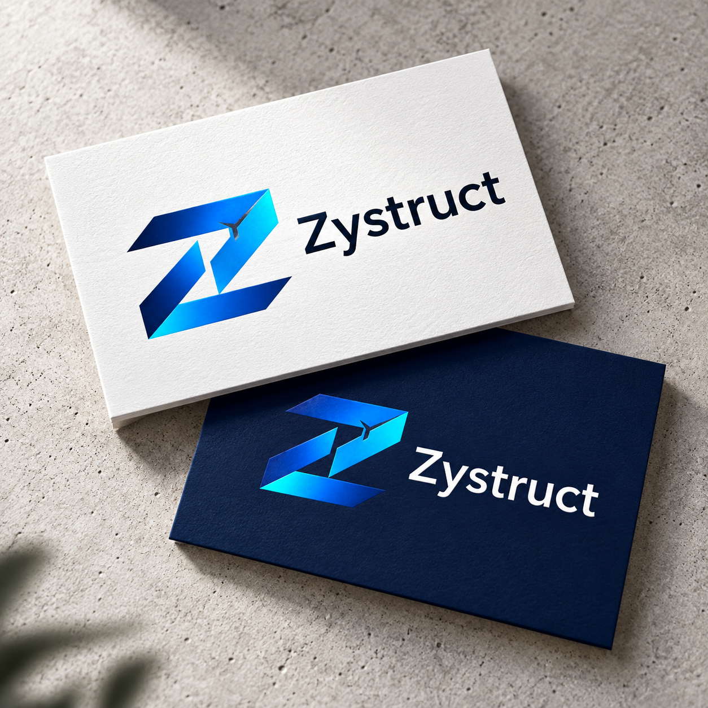

  

    

  

  

    <strong>Arquitectura sólida para productos digitales</strong> 
    <em>Diseñamos y construimos la infraestructura tecnológica que impulsa soluciones escalables, seguras y preparadas para evolucionar.</em>
  

  

    
    
    
  

---

### Sobre Zystruct

**Zystruct** es una firma costarricense de ingeniería y arquitectura de software. Diseñamos y desarrollamos soluciones digitales integrales combinando ingeniería rigurosa, estándares de código de alto nivel y una cultura orientada a la mantenibilidad y escalabilidad a largo plazo.

---

### Capacidades

* **Arquitectura de Software**: Diseño de sistemas escalables y APIs de alto rendimiento.
* **Desarrollo Multiplataforma**: Aplicaciones móviles multiplataforma y plataformas web modernas y reactivas.
* **Backend y Sistemas**: Procesamiento asíncrono de eventos, alta concurrencia, bases de datos relacionales y gestión de estado en memoria.
* **Inteligencia Artificial y Datos**: Modelos predictivos, visión computacional aplicada y analítica de datos en producción.
* **Cloud y Calidad Continua**: Automatización CI/CD, infraestructura contenerizada y suites automatizadas de pruebas end-to-end.

---

### Proyectos

  

#### ZyBus
Plataforma integral orientada a la digitalización, telemetría y modernización operativa del transporte de pasajeros, integrando backend asíncrono, panel de control web geoespacial y aplicaciones móviles para usuarios y operadores.

---

### Identidad Corporativa

  

---

### Contacto

* **GitHub:** [github.com/Zystruct](https://github.com/Zystruct)
* **Ubicación:** San José, Costa Rica

 

  © 2026 Zystruct. Todos los derechos reservados.

